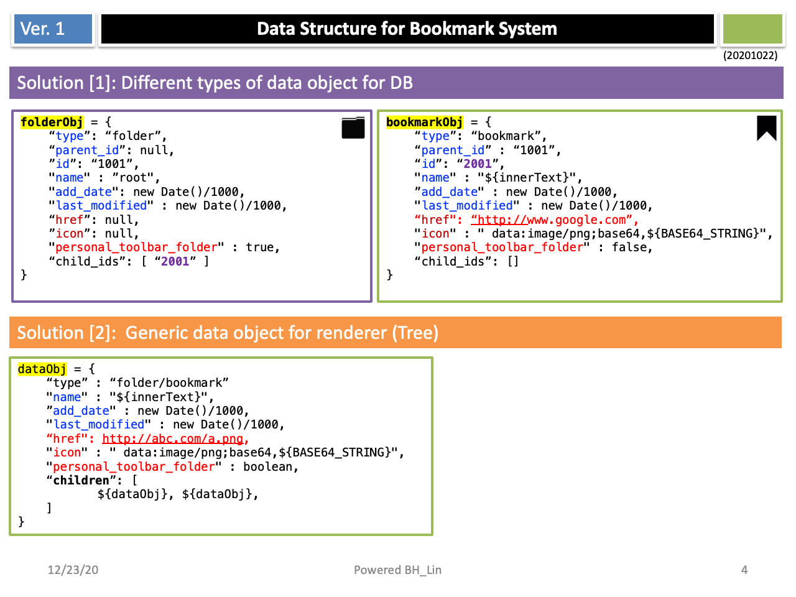
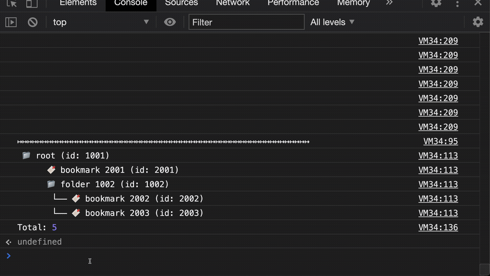

#Bookmark synchronizer

This is a demo to show you how to build a bookmark data structure.  
We need to consider the following issues:  
-Bookmarks need to be aligned in order  
-Need to have multiple subfolders  
-Easy to store on the server side  
-General data structure of the list view   

## Demo
